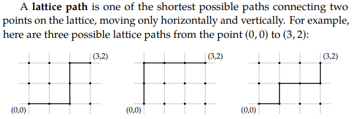
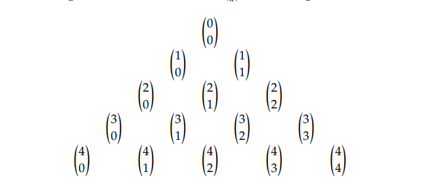
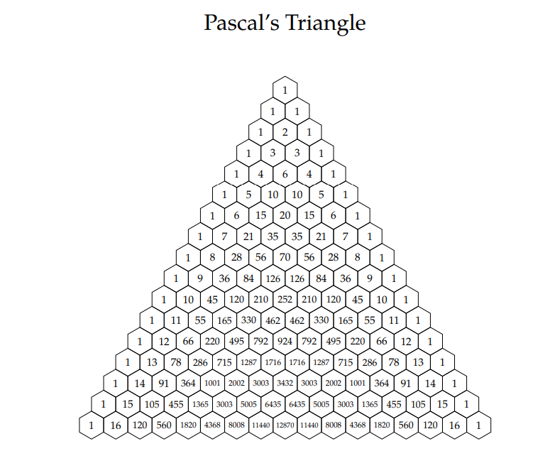

## Discrete Math Counting Chapter 1.2: Binomial Coefficients

### Bit Strings: 
- An n-bit string is a bit string that has the length n. That is a string containing n symbols, each of which is a bit, either 0 or 1.
- The weight of a bit string is the number of 1’s in it.
- $B^N$ is the set of all n-bit strings.
- $B^n_k$ is the set of all n-bit strings of weight k.

For example $B^2_1$ can be 01 or 10.

### Latice Paths

Latice paths, are the shortest possible paths between two points.

### Binomial Coefficients

Binomial coefficients are expanded versions of binomials, for example, the binomial coefficent of $(x+y)^3$ is: $$x^3 + 3x^2y + 3xy^2 + y^3$$

For each interger where n ≥ 0 and integer k with 0 ≤ k ≤ n there is a
number: 

$${n}\choose{k}$$

read "n choose k." We have:

* ${{n}\choose{k}} = {|B^n_k|}$, the number of n-bit strings of weight k.
* ${n}\choose{k}$ is the number of subsets of size n each with cardinality k. 
* ${n}\choose{k}$ is the number of latice paths of length n containing k steps
  to the right. 
* ${n}\choose{k}$ is the coefficient of ${x}^{k}{y}^{n-k}$ in the expansion of
  ${(x + y)}^n$. 
* ${n}\choose{k}$ is the number of ways to select k objects from a total of
  n objects. 

Binomial Coefficients allow you to express all the ways a set can be generated.

### Pascals Triangle:

Pascals Triangle allows us to calculate binomials using recurrence rlation.
#### Binomial Coefficents Triangle:

#### Pascals Triangle:
